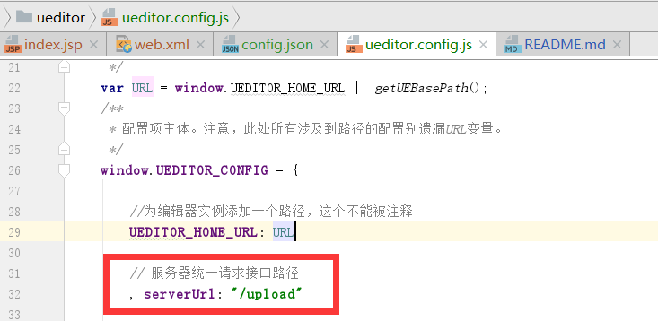

# xueditor
xueditor是对百度文本编辑器ueditor的扩展，支持自定义上传文件的存储方式.

由于ueditor服务端代码写死了只能上传到本地存储，有的时候，我们希望将图片、视频等文件上传到其他地方，例如阿里云OSS上。这给我们开发带来不便。

xueditor对java版本的源码进行了改造，支持自定义上传文件的存储方式。接入方式如下：

#### 1 添加maven依赖

    <dependency>
          <groupId>com.tianshouzhi</groupId>
          <artifactId>xueditor</artifactId>
          <version>1.0.0</version>
    </dependency>

#### 2 自定义上传实现类
xueditor提供了一个接口Uploader，自定义上传实现类需要实现这个接口。以下是笔者编写的一个上传到阿里云oss的Uploader实现。
(如果使用其他的云存储，实现方案也类似，只需要自己编写一个类实现Uploader接口即可)

引入阿里云oss sdk依赖

    <dependency>
            <groupId>com.aliyun.oss</groupId>
            <artifactId>aliyun-sdk-oss</artifactId>
            <version>2.6.1</version>
    </dependency>

AliyunOSSUploader.java

    public class AliyunOSSUploader implements Uploader{
        private static String bucketName = "your bucketName";
        private static final String ACCESS_PREFIX="外网域名";
        private static String endpoint = "your endpoint";
        private static String accessKeyId = "your accessKeyId";
        private static String accessKeySecret = "your accessKeySecret";
        private static OSSClient ossClient=new OSSClient(endpoint, accessKeyId, accessKeySecret);
    
        @Override
        public String upload(InputStream in,String path) throws Exception{
             String url=null;
             if(path.startsWith("/")){
                 path=path.substring(1,path.length());
             }
             byte[] bytes = IOUtils.toByteArray(in);
             PutObjectResult putObjectResult = ossClient.putObject(new PutObjectRequest(bucketName, path, new ByteArrayInputStream(bytes)));
             return ACCESS_PREFIX+path;
        }
    }

这里用到了上传文件到阿里云的参数：

bucketName：图片上传到哪个bucket 
ACCESS_PREFIX:表示外网域名 
endpoint：是上传文件的域名
accessKeyId
accessKeySecret

请读者自行在阿里云OSS控制台上查找相关配置项的值

####3 在web.xml中配置servlet，并指定自定上传实现类
    <servlet>
        <servlet-name>ueditor</servlet-name>
        <servlet-class>com.tianshouzhi.xueditor.servlet.XUeditorServlet</servlet-class>
    </servlet>
    <servlet-mapping>
        <servlet-name>ueditor</servlet-name>
        <url-pattern>/upload</url-pattern>
    </servlet-mapping>

####4 修改ueditor.config.js文件的上传路径，将serverUrl值改为/upload

#### 5 完整使用案例参考